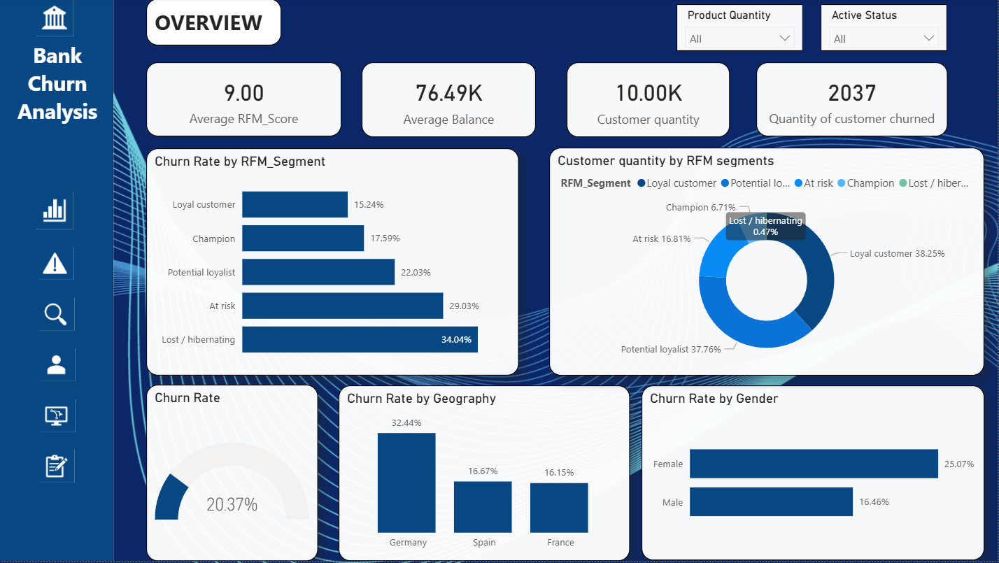

# Bank Churn Analysis

## Project Overview

This project is an end-to-end machine learning application for predicting customer churn in a retail banking context.

The main goal is to help a bank identify customers who are likely to leave, understand their customer value profile, and recommend a practical retention action. The project combines:

- Churn prediction using supervised machine learning
- RFM-style customer segmentation using banking behavior proxies
- A local Streamlit UI for interactive predictions
- A FastAPI service for API-based predictions
- MLflow tracking for experiment metrics and model artifacts
- Optional Docker serving for the trained model

The final application allows a user to enter a customer profile and receive:

- Predicted churn probability
- Churn risk tier
- RFM score breakdown
- RFM customer segment
- Retention priority
- Recommended retention action

## Business Aim

Customer churn is expensive for banks because acquiring a new customer usually costs more than retaining an existing one. This project aims to support proactive retention by forecasting whether a customer is likely to churn and by adding RFM-style context to explain the customer's relationship quality.

In this project, RFM is adapted for bank customer data:

- Recency proxy: customer activity and tenure
- Frequency proxy: number of products, active membership, and credit card ownership
- Monetary proxy: account balance and estimated salary

The model predicts churn probability, while the RFM logic helps translate the prediction into a more business-friendly customer segment and action recommendation.

## Dashboard General Findings

The Power BI executive overview below summarises churn performance, customer mix, and RFM-based retention risk.



### Key Insights

- Overall churn rate is `20.37%`, with `2,037` churned customers out of `10,000` total customers.
- The average RFM score is `9.00`, suggesting the customer base is concentrated around a mid-tier relationship strength rather than being heavily weighted toward the highest-value segment.
- `Lost / hibernating` customers have the highest churn rate at `34.04%`, followed by `At risk` customers at `29.03%`.
- `Loyal customer` has the lowest churn rate at `15.24%`, showing that stronger relationship quality is associated with lower churn.
- The largest customer groups are `Loyal customer` at `38.25%` and `Potential loyalist` at `37.76%`, so even moderate churn in these groups can create a large absolute number of lost customers.
- Germany has the highest churn rate at `32.44%`, almost double Spain at `16.67%` and France at `16.15%`.
- Female customers show a higher churn rate at `25.07%` compared with male customers at `16.46%`.

### Business Implications

- Retention campaigns should prioritise `Lost / hibernating` and `At risk` customers because these groups show the highest churn rates.
- Germany should be investigated as a market-specific churn issue. Pricing, product experience, service quality, or competitor pressure may be materially different from France and Spain.
- The bank should protect the large `Loyal customer` and `Potential loyalist` base with early engagement, cross-sell discipline, and proactive service because these groups represent most of the portfolio.

## Project Structure

```text
Bank_churn_analysis/
|
|-- .github/
|   |-- workflows/ci.yml             # GitHub Actions workflow
|
|-- app/
|   |-- main.py                      # FastAPI app and browser UI
|   |-- predictor.py                 # Inference layer used by FastAPI and Streamlit
|   |-- schemas.py                   # Request and response validation
|   |-- streamlit_app.py             # Streamlit UI
|
|-- artifacts/
|   |-- classification_report.json   # Generated model evaluation report
|   |-- data_quality_report.json     # Generated data validation report
|   |-- feature_names.json           # Generated feature schema used at inference
|
|-- configs/
|   |-- config.yaml                  # Project paths, model settings, RFM weights
|
|-- data/
|   |-- raw/                         # Place the raw CSV dataset here
|   |-- processed/                   # Generated processed data
|
|-- docker/
|   |-- Dockerfile                   # Container image for API serving
|   |-- docker-compose.yml           # Docker Compose service definition
|
|-- great_expectations/
|   |-- validate.py                  # Data validation checks
|
|-- notebooks/                       # Optional notebook workspace
|
|-- scripts/
|   |-- train_pipeline.py            # Full training pipeline
|   |-- start_app.py                 # FastAPI launcher
|
|-- src/
|   |-- data/ingest.py               # Load and validate data
|   |-- features/engineer.py         # Feature engineering
|   |-- features/rfm.py              # RFM scoring and segmentation
|   |-- models/train.py              # Model training
|   |-- models/evaluate.py           # Evaluation and plots
|   |-- utils/config_loader.py       # YAML and environment config loader
|   |-- utils/logger.py              # Project logger
|
|-- tests/
|   |-- test_api.py                  # FastAPI endpoint tests
|   |-- test_features.py             # Feature engineering tests
|
|-- Visualisations/
|   |-- Bank_churn_analysis.pbix     # Power BI dashboard file
|   |-- executive_overview.png       # Cropped dashboard image for README insights
|   |-- rfm_feature_engineering.sql  # SQL version of RFM logic
|   |-- table_creation.sql           # SQL table setup
|
|-- EDA.ipynb                        # Main exploratory analysis notebook
|-- bank_churn_predictions.csv       # Generated scoring output
|-- .gitignore
|-- requirements.txt
|-- README.md
```
## Requirements

Recommended environment:

- Python 3.11
- Windows PowerShell, macOS terminal, or Linux shell
- Docker Desktop, only if you want to serve the app with Docker

Install Python dependencies from:

```text
requirements.txt
```

## Quickstart: Run Locally With Streamlit

The recommended beginner-friendly workflow is:

1. Install dependencies
2. Place the dataset in the expected folder
3. Train the model pipeline
4. Launch the Streamlit UI

Run all commands from the `Bank_churn_analysis` folder.

### 1. Move Into The Project Folder

If you are currently in the parent repository folder:

```powershell
cd Bank_churn_analysis
```

### 2. Create And Activate A Virtual Environment

On Windows PowerShell:

```powershell
python -m venv ..\venv
..\venv\Scripts\Activate.ps1
```

On macOS or Linux:

```bash
python -m venv ../venv
source ../venv/bin/activate
```

### 3. Install Dependencies

```powershell
pip install -r requirements.txt
```

### 4. Add The Dataset

Place the raw dataset here:

```text
data/raw/Bank_churn_RFM.csv
```

The default raw data path is configured in:

```text
configs/config.yaml
```

If your file has a different name, either rename it to `Bank_churn_RFM.csv` or update the `paths.raw_data` value in `configs/config.yaml`.

### 5. Train The Model Pipeline

For a faster training run without Optuna tuning:

```powershell
python scripts/train_pipeline.py --no-tune
```

For the full training run with Optuna tuning:

```powershell
python scripts/train_pipeline.py
```

The training pipeline will:

- Load and validate the raw dataset
- Create processed data
- Engineer model features
- Train Logistic Regression, Random Forest, and XGBoost models
- Select the best model by test ROC-AUC
- Save the trained pipeline and feature schema
- Generate evaluation metrics and plots
- Log metrics and artifacts to MLflow

After training, these files should exist:

```text
artifacts/best_model.pkl
artifacts/feature_names.json
data/processed/features.parquet
```

These files are required for local prediction.

### 6. Launch The Streamlit UI

```powershell
streamlit run app/streamlit_app.py
```

Use the form to enter a customer profile and click `Predict Churn Risk`.

## Run With Docker

Docker is used to serve an already-trained model. It does not train the model by default.

Train locally first:

```powershell
python scripts/train_pipeline.py
```

Then start the API container:

```powershell
docker compose -f docker/docker-compose.yml up --build -d api
```

Open:

```text
http://localhost:8000/ui
```

Check container logs:

```powershell
docker logs bank_churn_api
```

Stop the container:

```powershell
docker compose -f docker/docker-compose.yml down
```

If Docker cannot connect to the Docker engine, open Docker Desktop first and wait until it is fully running.

## Prediction API Example

After starting the FastAPI app, you can send a single prediction request:

```powershell
curl -X POST http://localhost:8000/predict `
  -H "Content-Type: application/json" `
  -d '{
    "CreditScore": 650,
    "Geography": "France",
    "Gender": "Male",
    "Age": 42,
    "Tenure": 5,
    "Balance": 75000.0,
    "NumOfProducts": 2,
    "HasCrCard": 1,
    "IsActiveMember": 1,
    "EstimatedSalary": 98000.0
  }'
```

Example response:

```json
{
  "churn_probability": 0.3595,
  "churn_predicted": 0,
  "risk_segment": "Medium",
  "rfm_score": 10,
  "rfm_segment": "Loyal Customer",
  "retention_priority": 4,
  "r_score": 4,
  "f_score": 3,
  "m_score": 3,
  "recommendation": "Upsell opportunity - cross-sell one additional product."
}
```

## Recommended Local Workflow

For most users, this is the simplest complete workflow:

```powershell
cd Bank_churn_analysis
python -m venv ..\venv
..\venv\Scripts\Activate.ps1
pip install -r requirements.txt
python scripts/train_pipeline.py --no-tune
streamlit run app/streamlit_app.py
```
