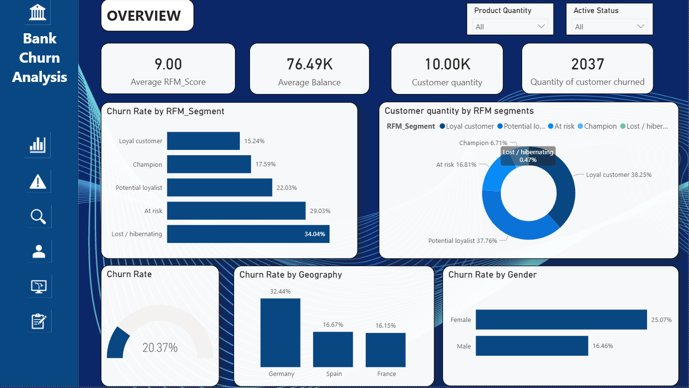
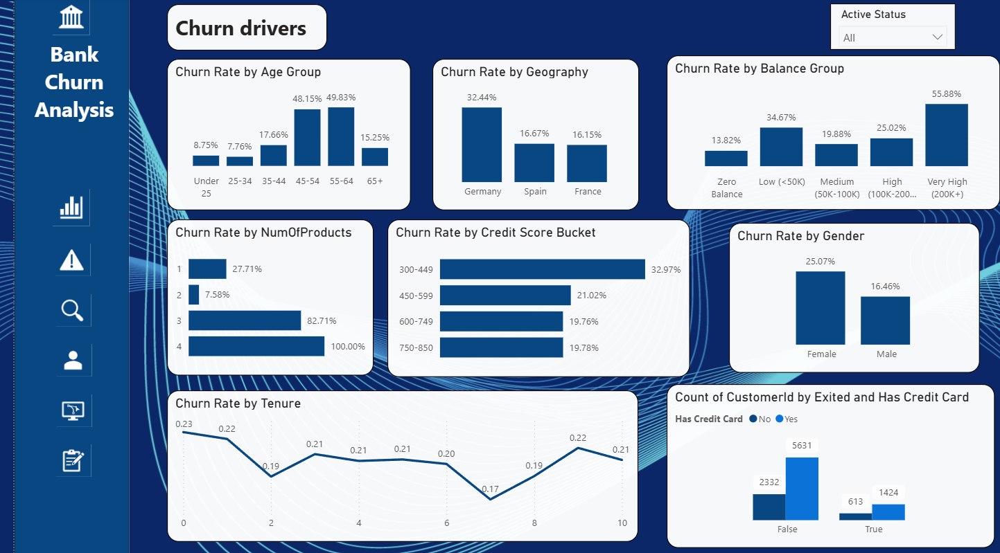
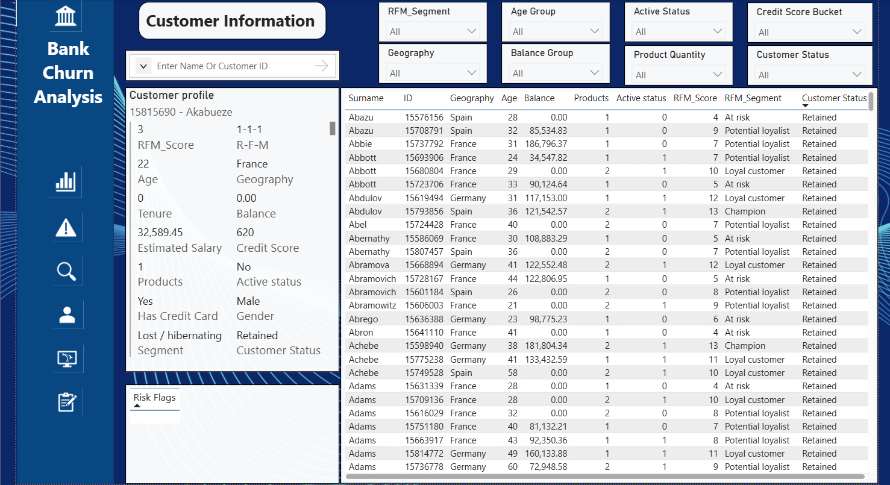
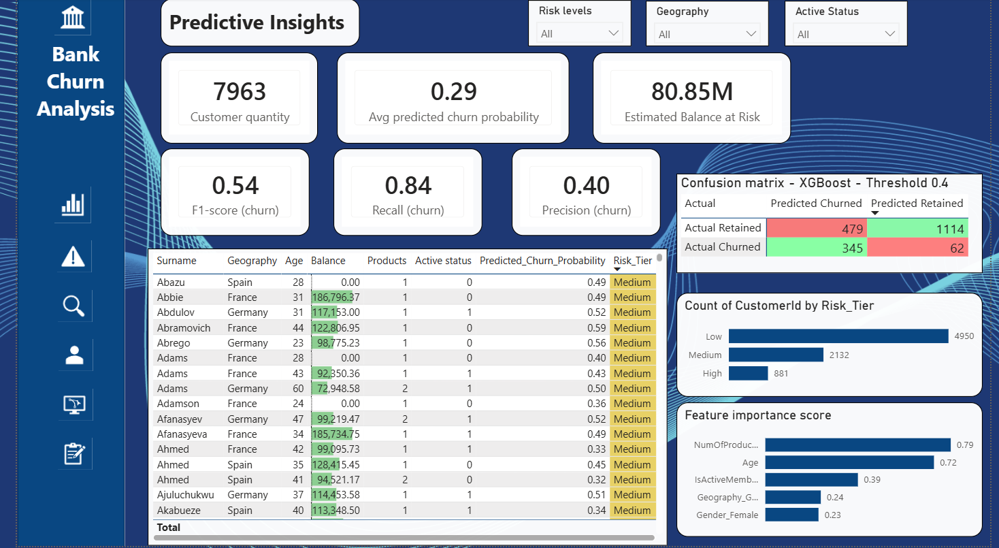
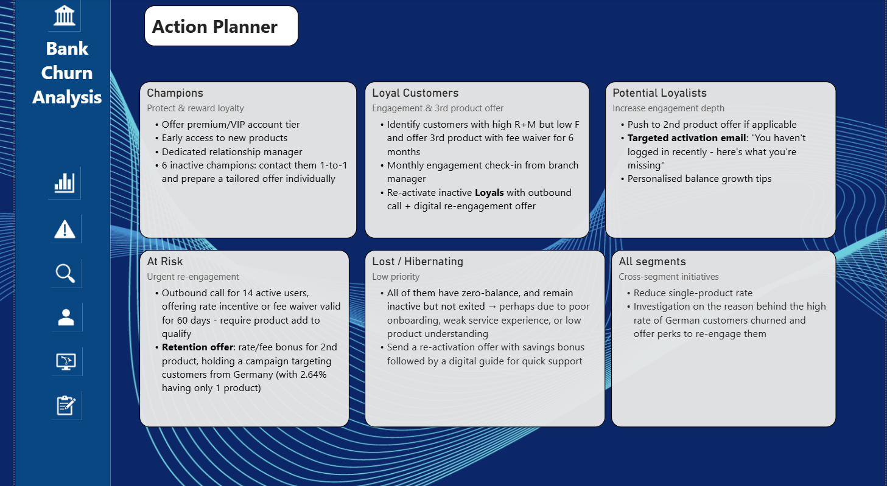

# Bank Churn Analysis

## Project Overview

This project is an end-to-end machine learning application for predicting customer churn in a retail banking context.

The main goal is to help a bank identify customers who are likely to leave, understand their customer value profile, and recommend a practical retention action. The project combines:

- Churn prediction using supervised machine learning
- RFM-style customer segmentation using banking behavior proxies
- A local Streamlit UI for interactive predictions
- A FastAPI service for API-based predictions
- MLflow tracking for experiment metrics and model artifacts
- Optional Docker serving for the trained model

The final application allows a user to enter a customer profile and receive:

- Predicted churn probability
- Churn risk tier
- RFM score breakdown
- RFM customer segment
- Retention priority
- Recommended retention action

## Business Aim

Customer churn is expensive for banks because acquiring a new customer usually costs more than retaining an existing one. This project aims to support proactive retention by forecasting whether a customer is likely to churn and by adding RFM-style context to explain the customer's relationship quality.

In this project, RFM is adapted for bank customer data:

- Recency proxy: customer activity and tenure
- Frequency proxy: number of products, active membership, and credit card ownership
- Monetary proxy: account balance and estimated salary

The model predicts churn probability, while the RFM logic helps translate the prediction into a more business-friendly customer segment and action recommendation.

## Power BI Dashboard

The Power BI report contains an executive overview, churn-driver analysis, RFM segmentation, customer-level lookup, predictive model results, and segment-based retention recommendations. The screenshots below show the report pages and the insights visible in the displayed filter state. Values may change when report filters are applied.

### Executive Overview



This page summarises churn, customer mix, and RFM segments:

- The dataset contains `10,000` customers, of whom `2,037` churned, for an overall churn rate of `20.37%`.
- Average RFM score is `9.00`; average balance is approximately `76.49K`.
- Loyal customers (`38.25%`) and Potential loyalists (`37.76%`) are the largest segments.
- Lost / hibernating customers have the highest segment churn rate (`34.04%`), followed by At risk (`29.03%`). Loyal customers have the lowest (`15.24%`).
- Germany has the highest geographic churn rate (`32.44%`), compared with Spain (`16.67%`) and France (`16.15%`). Female customers show `25.07%` churn versus `16.46%` for male customers.

### Churn Drivers



This page compares churn rates across age, geography, balance, product-count, credit-score, tenure, and gender groups:

- The displayed rates peak for ages `55–64` (`49.83%`) and `45–54` (`48.15%`); they are lower for ages `25–34` (`7.76%`) and `Under 25` (`8.75%`).
- Churn is highest in Germany (`32.44%`) and among customers in the Very High balance group (`55.88%`).
- Churn is especially high among customers with 3 products (`82.71%`) and 4 products (`100%`), indicating a group to investigate alongside their customer counts.
- Credit-score group rates range from `19.76%` (`600–749`) to `32.97%` (`300–449`). The tenure chart stays roughly between `17%` and `23%`.
- Credit-card ownership is associated with similar churn rates: about `20.8%` for customers without a card and `20.2%` for cardholders.

### RFM Investigation


This page compares the five RFM segments by customer count, geography, average balance and salary, number of products, age, and credit score:

- Segment counts are Champions `671`, Loyal customers `3,825`, Potential loyalists `3,776`, At risk `1,681`, and Lost / hibernating `47` (10,000 customers total).
- Average products per customer decline from `2.13` for Champions to `1.00` for Lost / hibernating.
- Champions have the highest displayed average balance (`131K`), while Lost / hibernating customers average approximately `0K` balance. Average salary is highest for Champions (`122K`) and lowest for Lost / hibernating (`59K`).
- Average ages are close across segments (about `38–40`). Average credit scores are also similar, with Lost / hibernating lowest (`633.43`).
- The country-by-segment churn view highlights elevated rates in Germany for At risk (`51%`), Potential loyalist (`39%`), and Loyal customer (`28%`) groups. France has the highest displayed rate for Lost / hibernating customers (`42%`).

### Customer Analysis



This is a customer lookup and drill-down page. It provides filters for segment, age group, activity, geography, balance, product count, credit score, and customer status, alongside a customer table and a selected customer's profile. The example profile displays both an RFM segment and a customer status; these are separate fields, so a customer can be classed as `Lost / hibernating` by the RFM rules while still showing `Retained` as their churn outcome. The page is designed for individual-record exploration rather than portfolio-wide conclusions.

### Predictive Insights



This page presents model scores, churn-risk tiers, a confusion matrix, and feature-importance scores:

- The displayed population is `7,963` customers, with average predicted churn probability `0.29` and estimated balance at risk of `80.85M`.
- At the displayed `0.4` decision threshold, churn recall is `0.84`, precision is `0.40`, and F1-score is `0.54`. The model identifies most churners, while the moderate precision means risk flags should be reviewed before costly retention offers are made.
- The page classifies `4,950` customers as Low risk, `2,132` as Medium risk, and `881` as High risk.
- Number of products (`0.79`) and age (`0.72`) have the highest displayed feature-importance scores, followed by active-member status (`0.39`). These are useful signals for prioritization and investigation.

### Action Planner



This page translates the segments into suggested retention actions:

- **Champions:** protect loyalty through premium service, early access, and personal relationship management.
- **Loyal customers:** deepen engagement and consider a third-product offer, with targeted follow-up for inactive customers.
- **Potential loyalists:** encourage activation and product adoption through personalized outreach.
- **At Risk:** prioritize direct re-engagement and retention offers.
- **Lost / hibernating:** use lower-priority reactivation and support offers; the page describes this group as inactive and zero-balance.
- **All segments:** investigate Germany's churn pattern and reduce single-product dependence.

## Business Implications

- **Prioritize retention by risk.** Lost / hibernating customers have the highest observed segment churn rate (`34.04%`), followed by At risk customers (`29.03%`). Focus urgent, tailored re-engagement on these groups, while matching the effort to each segment's size and likely value.
- **Investigate Germany's elevated churn.** Germany's churn rate (`32.44%`) is substantially above Spain (`16.67%`) and France (`16.15%`). Compare customer feedback, service experience, product fit, and competitor conditions across markets before selecting a market-specific intervention.
- **Protect the largest customer segments.** Loyal customers (`38.25%`) and Potential loyalists (`37.76%`) together represent three quarters of the customer base. Use proactive service, relevant engagement, and carefully targeted cross-sell to retain these customers and deepen relationships without creating avoidable friction.
- **Use model scores to focus outreach.** The predictive page's high recall can help surface customers at risk, while its `0.40` precision means a prediction should guide review and prioritization rather than trigger an expensive offer automatically.
- **Investigate customer patterns before scaling offers.** Churn varies across age, balance, and product-count groups. Validate the size and value of each group, then test targeted actions and compare retention outcomes before broad rollout.

## Project Structure

```text
Bank_churn_analysis/
|
|-- .github/
|   |-- workflows/ci.yml             # GitHub Actions workflow
|
|-- app/
|   |-- main.py                      # FastAPI app and browser UI
|   |-- predictor.py                 # Inference layer used by FastAPI and Streamlit
|   |-- schemas.py                   # Request and response validation
|   |-- streamlit_app.py             # Streamlit UI
|
|-- artifacts/
|   |-- classification_report.json   # Generated model evaluation report
|   |-- data_quality_report.json     # Generated data validation report
|   |-- feature_names.json           # Generated feature schema used at inference
|
|-- configs/
|   |-- config.yaml                  # Project paths, model settings, RFM weights
|
|-- data/
|   |-- raw/                         # Place the raw CSV dataset here
|   |-- processed/                   # Generated processed data
|
|-- docker/
|   |-- Dockerfile                   # Container image for API serving
|   |-- docker-compose.yml           # Docker Compose service definition
|
|-- great_expectations/
|   |-- validate.py                  # Data validation checks
|
|-- notebooks/                       # Optional notebook workspace
|
|-- scripts/
|   |-- train_pipeline.py            # Full training pipeline
|   |-- start_app.py                 # FastAPI launcher
|
|-- src/
|   |-- data/ingest.py               # Load and validate data
|   |-- features/engineer.py         # Feature engineering
|   |-- features/rfm.py              # RFM scoring and segmentation
|   |-- models/train.py              # Model training
|   |-- models/evaluate.py           # Evaluation and plots
|   |-- utils/config_loader.py       # YAML and environment config loader
|   |-- utils/logger.py              # Project logger
|
|-- tests/
|   |-- test_api.py                  # FastAPI endpoint tests
|   |-- test_features.py             # Feature engineering tests
|
|-- Visualisations/
|   |-- Bank_churn_analysis.pbix     # Power BI dashboard file
|   |-- executive_overview.png       # Executive overview dashboard screenshot
|   |-- churn_driver.png             # Churn drivers dashboard screenshot
|   |-- RFM investigation.png        # RFM analysis dashboard screenshot
|   |-- Customer_analysis.png        # Customer information dashboard screenshot
|   |-- Predictive_Insights.png      # Predictive insights dashboard screenshot
|   |-- Action_planner.png           # Retention action planner screenshot
|   |-- rfm_feature_engineering.sql  # SQL version of RFM logic
|   |-- table_creation.sql           # SQL table setup
|
|-- EDA.ipynb                        # Main exploratory analysis notebook
|-- bank_churn_predictions.csv       # Generated scoring output
|-- .gitignore
|-- requirements.txt
|-- README.md
```
## Requirements

Recommended environment:

- Python 3.11
- Windows PowerShell, macOS terminal, or Linux shell
- Docker Desktop, only if you want to serve the app with Docker

Install Python dependencies from:

```text
requirements.txt
```

## Quickstart: Run Locally With Streamlit

The recommended beginner-friendly workflow is:

1. Install dependencies
2. Place the dataset in the expected folder
3. Train the model pipeline
4. Launch the Streamlit UI

Run all commands from the `Bank_churn_analysis` folder.

### 1. Move Into The Project Folder

If you are currently in the parent repository folder:

```powershell
cd Bank_churn_analysis
```

### 2. Create And Activate A Virtual Environment

On Windows PowerShell:

```powershell
python -m venv ..\venv
..\venv\Scripts\Activate.ps1
```

On macOS or Linux:

```bash
python -m venv ../venv
source ../venv/bin/activate
```

### 3. Install Dependencies

```powershell
pip install -r requirements.txt
```

### 4. Add The Dataset

Place the raw dataset here:

```text
data/raw/Bank_churn_RFM.csv
```

The default raw data path is configured in:

```text
configs/config.yaml
```

If your file has a different name, either rename it to `Bank_churn_RFM.csv` or update the `paths.raw_data` value in `configs/config.yaml`.

### 5. Train The Model Pipeline

For a faster training run without Optuna tuning:

```powershell
python scripts/train_pipeline.py --no-tune
```

For the full training run with Optuna tuning:

```powershell
python scripts/train_pipeline.py
```

The training pipeline will:

- Load and validate the raw dataset
- Create processed data
- Engineer model features
- Train Logistic Regression, Random Forest, and XGBoost models
- Select the best model by test ROC-AUC
- Save the trained pipeline and feature schema
- Generate evaluation metrics and plots
- Log metrics and artifacts to MLflow

After training, these files should exist:

```text
artifacts/best_model.pkl
artifacts/feature_names.json
data/processed/features.parquet
```

These files are required for local prediction.

### 6. Launch The Streamlit UI

```powershell
streamlit run app/streamlit_app.py
```

Use the form to enter a customer profile and click `Predict Churn Risk`.

## Run With Docker

Docker is used to serve an already-trained model. It does not train the model by default.

Train locally first:

```powershell
python scripts/train_pipeline.py
```

Then start the API container:

```powershell
docker compose -f docker/docker-compose.yml up --build -d api
```

Open:

```text
http://localhost:8000/ui
```

Check container logs:

```powershell
docker logs bank_churn_api
```

Stop the container:

```powershell
docker compose -f docker/docker-compose.yml down
```

If Docker cannot connect to the Docker engine, open Docker Desktop first and wait until it is fully running.

## Prediction API Example

After starting the FastAPI app, you can send a single prediction request:

```powershell
curl -X POST http://localhost:8000/predict `
  -H "Content-Type: application/json" `
  -d '{
    "CreditScore": 650,
    "Geography": "France",
    "Gender": "Male",
    "Age": 42,
    "Tenure": 5,
    "Balance": 75000.0,
    "NumOfProducts": 2,
    "HasCrCard": 1,
    "IsActiveMember": 1,
    "EstimatedSalary": 98000.0
  }'
```

Example response:

```json
{
  "churn_probability": 0.3595,
  "churn_predicted": 0,
  "risk_segment": "Medium",
  "rfm_score": 10,
  "rfm_segment": "Loyal Customer",
  "retention_priority": 4,
  "r_score": 4,
  "f_score": 3,
  "m_score": 3,
  "recommendation": "Upsell opportunity - cross-sell one additional product."
}
```

## Recommended Local Workflow

For most users, this is the simplest complete workflow:

```powershell
cd Bank_churn_analysis
python -m venv ..\venv
..\venv\Scripts\Activate.ps1
pip install -r requirements.txt
python scripts/train_pipeline.py --no-tune
streamlit run app/streamlit_app.py
```
